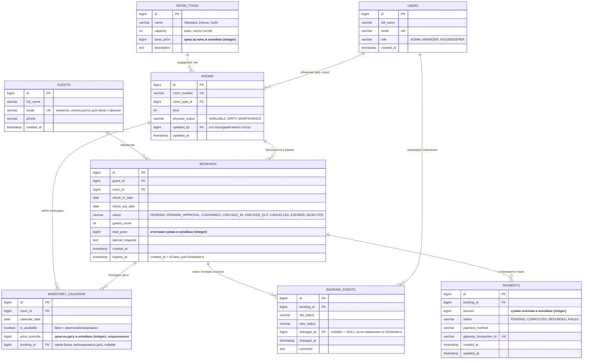

# ER-диаграмма базы данных — Hotel Booking System (HBS)

## Назначение документа

Документ описывает логическую модель данных системы бронирования отелей на уровне MVP. Диаграмма построена на основе решений, зафиксированных в ТЗ и ЧТЗ: разделение физического статуса номера (`rooms.physical_status`) и календаря занятости (`inventory_calendar`), Enum-статусы бронирования, аудит через `booking_events`, отдельная таблица платежей.

---

## Диаграмма

---

## Что сознательно не включено в MVP-модель

- Сущность `hotels` / `properties` — MVP рассчитан на одну гостиницу до 100 номеров; мультиотельность вынесена в раздел "Roadmap" как будущее расширение до микросервисной архитектуры.
- Тарифные планы (rate plans) как отдельная сущность — в MVP цена хранится на уровне `room_types.base_price` с точечным переопределением через `inventory_calendar.price_override`.
- Скидки/промокоды — вне границ MVP (см. Vision_and_Scope.md, раздел "что не входит").
